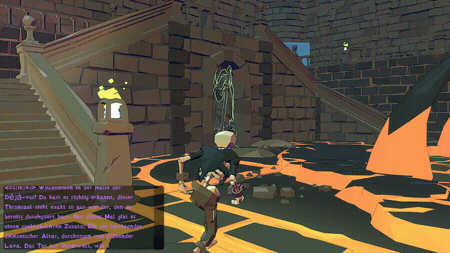

# Sneaky – Stealth/Puzzle Game in Unity

This project was developed at FH Wedel as part of the **Level Design** module.  

A 3D puzzle/stealth game prototype built in Unity, with a strong focus on level design.  
Responsibilities included enemy AI, animation systems, interactive objects, chat window, and shader effects.

## Levels

- **Level01** – Lukas Frahm
- **Level02** – Florian Koester

## Controls

**Keyboard:**
- WASD to move
- E – interact
- Left Click – attack (only with weapon)
- Enter – open chat
- F1 – show hints (guide)
- 1 – load Level01
- 2 – load Level02

(Controller support available)

## Gallery

## Assets

Assets used: Synty Store

## Download

A release package is available [here](https://github.com/lufa3014/Level-Design/releases/latest) containing:

- Unity build (Windows)